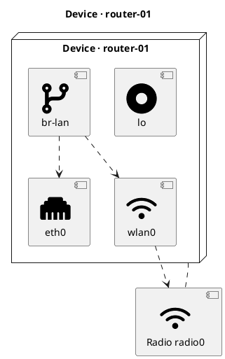

# router-01

## Diagram



## Paper


**Type:** `DeviceConfiguration`

<!-- netjson-section: general -->
## General

- **description:** `OpenWRT gateway for the lab`

<!-- netjson-section: dns -->
## DNS

- **Servers:** `8.8.8.8`, `1.1.1.1`
- **Search:** `lan`

<!-- netjson-section: interfaces -->
## Interfaces

### lo _(Loopback)_
- **Addresses:**
    - `127.0.0.1/8` (ipv4) via static

### eth0 _(Ethernet)_
- **MAC:** `aa:bb:cc:dd:ee:f0`
- **MTU:** `1500`
- **Autostart:** `true`
- **Addresses:**
    - `192.168.1.1/24` (ipv4) via static

### wlan0 _(Wireless)_
- **MAC:** `aa:bb:cc:dd:ee:f1`
- **MTU:** `1500`
- **Autostart:** `true`
- **Wireless mode:** `access_point`
- **SSID:** `LabMesh`
- **Encryption:** 

```json
{
  "ciphers": [
    "ccmp"
  ],
  "protocol": "wpa2_personal"
}
```


### br-lan _(Bridge)_
- **MTU:** `1500`
- **Autostart:** `true`
- **Addresses:**
    - `10.0.0.1/24` (ipv4) via static
- **Bridge members:** `eth0`, `wlan0`

<!-- netjson-section: radios -->
## Radios

### radio0
- **Protocol:** `802.11n`
- **Channel:** `6`
- **Channel width:** `20` MHz
- **TX power:** `17` dBm
- **Country:** `US`
- **Disabled:** `false`

