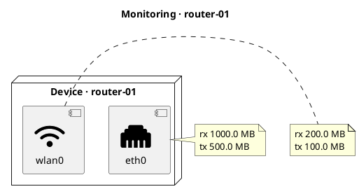

# router-01

## Diagram



## Paper


**Type:** `DeviceMonitoring`

<!-- netjson-section: general -->
## General

- **Local time:** `1735689600` (epoch)
- **Uptime:** `432000` s

<!-- netjson-section: resources -->
## Resources

```json
{
  "disk": {
    "total": 67108864,
    "used": 33554432
  },
  "load": [
    0.15,
    0.12,
    0.1
  ],
  "memory": {
    "buffered": 8388608,
    "free": 67108864,
    "total": 134217728
  },
  "swap": {
    "free": 0,
    "total": 0
  }
}
```

<!-- netjson-section: statistics -->
## Interface statistics

### eth0 _(Ethernet)_
- **Up:** `true`
- **MAC:** `aa:bb:cc:dd:ee:f0`
- **Statistics:**

```json
{
  "rx_bytes": 1048576000,
  "rx_packets": 1000000,
  "tx_bytes": 524288000,
  "tx_packets": 750000
}
```

### wlan0 _(Wireless)_
- **Up:** `true`
- **MAC:** `aa:bb:cc:dd:ee:f1`
- **Statistics:**

```json
{
  "rx_bytes": 209715200,
  "rx_packets": 350000,
  "tx_bytes": 104857600,
  "tx_packets": 280000
}
```

