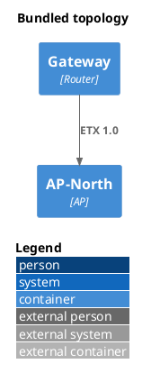

# NetworkCollection

## Diagram

## Paper

**Type:** `NetworkCollection` · **Members:** `2`

<!-- netjson-section: member-1 -->
## Member 1

### Bundled topology

**Type:** `NetworkGraph` · **Protocol:** `OLSR`

<!-- netjson-section: member-2 -->
## Member 2

### router-01

**Type:** `DeviceConfiguration`

<!-- netjson-section: interfaces -->
#### Interfaces

##### eth0 _(Ethernet)_
- **Addresses:**
    - `192.168.1.1/24` (ipv4) via static

