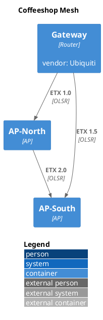

# Coffeeshop Mesh

## Diagram

## Paper

**Type:** `NetworkGraph` · **Protocol:** `OLSR` · **Version:** `0.6.6` · **Metric:** `ETX` · **Router id:** `10.0.0.1` · **Topology id:** `topo-mesh-01`

<!-- netjson-section: nodes -->
## Node metadata

### Gateway
_id:_ `10.0.0.1`
- **Local addresses:** `192.168.1.1`
- **vendor:** `Ubiquiti`

