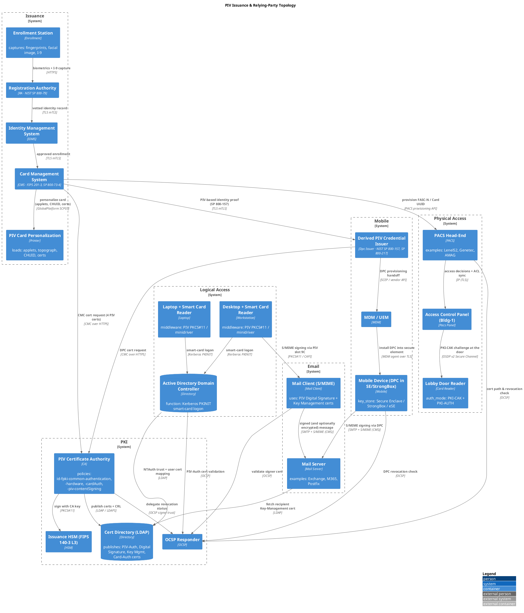

# PIV Issuance & Relying-Party Topology

## Diagram

## Paper

**Type:** `NetworkGraph` · **Protocol:** `Logical` · **Version:** `FIPS 201-3` · **Metric:** `TrustPath` · **Router id:** `cms.piv.example.gov` · **Topology id:** `piv-issuance-01`

<!-- netjson-section: nodes -->
## Node metadata

### Registration Authority
_id:_ `ra.piv`
- **domain:** `issuance`
- **standards:** `NIST SP 800-79`

### Enrollment Station
_id:_ `enroll.kiosk`
- **captures:** `fingerprints, facial image, I-9`
- **domain:** `issuance`

### Identity Management System
_id:_ `idms.piv`
- **domain:** `issuance`

### Card Management System
_id:_ `cms.piv`
- **domain:** `issuance`
- **standards:** `FIPS 201-3, SP 800-73-4`

### PIV Certificate Authority
_id:_ `ca.piv`
- **domain:** `pki`
- **policies:** `id-fpki-common-authentication, -hardware, -cardAuth, -piv-contentSigning`

### Issuance HSM (FIPS 140-3 L3)
_id:_ `hsm.piv`
- **domain:** `pki`

### Cert Directory (LDAP)
_id:_ `ldap.piv`
- **domain:** `pki`
- **publishes:** `PIV-Auth, Digital Signature, Key Mgmt, Card-Auth certs`

### OCSP Responder
_id:_ `ocsp.piv`
- **domain:** `pki`

### PIV Card Personalization
_id:_ `printer.piv`
- **domain:** `issuance`
- **loads:** `applets, topograph, CHUID, certs`

### PACS Head-End
_id:_ `pacs.headend`
- **domain:** `physical-access`
- **examples:** `LenelS2, Genetec, AMAG`

### Access Control Panel (Bldg-1)
_id:_ `pacs.panel.b1`
- **domain:** `physical-access`

### Lobby Door Reader
_id:_ `pacs.reader.lobby`
- **auth_mode:** `PKI-CAK + PKI-AUTH`
- **domain:** `physical-access`

### Active Directory Domain Controller
_id:_ `ad.dc`
- **domain:** `logical-access`
- **function:** `Kerberos PKINIT smart-card logon`

### Desktop + Smart Card Reader
_id:_ `workstation.1`
- **domain:** `logical-access`
- **middleware:** `PIV PKCS#11 / minidriver`

### Laptop + Smart Card Reader
_id:_ `laptop.1`
- **domain:** `logical-access`
- **middleware:** `PIV PKCS#11 / minidriver`

### Derived PIV Credential Issuer
_id:_ `dpc.issuer`
- **domain:** `mobile`
- **standards:** `NIST SP 800-157, SP 800-217`

### MDM / UEM
_id:_ `mdm`
- **domain:** `mobile`

### Mobile Device (DPC in SE/StrongBox)
_id:_ `mobile.1`
- **domain:** `mobile`
- **key_store:** `Secure Enclave / StrongBox / eSE`

### Mail Server
_id:_ `mail.server`
- **domain:** `email`
- **examples:** `Exchange, M365, Postfix`

### Mail Client (S/MIME)
_id:_ `mail.client`
- **domain:** `email`
- **uses:** `PIV Digital Signature + Key Management certs`

