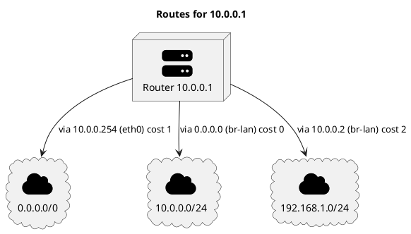

# Routes for 10.0.0.1

## Diagram

## Paper

**Type:** `NetworkRoutes` · **Router id:** `10.0.0.1`

<!-- netjson-section: routes -->
## Routes

| Destination | Next hop | Device | Cost | Source |
|-------------|----------|--------|------|--------|
| `0.0.0.0/0` | `10.0.0.254` | `eth0` | `1` | `static` |
| `10.0.0.0/24` | `0.0.0.0` | `br-lan` | `0` | `kernel` |
| `192.168.1.0/24` | `10.0.0.2` | `br-lan` | `2` | `olsr` |

